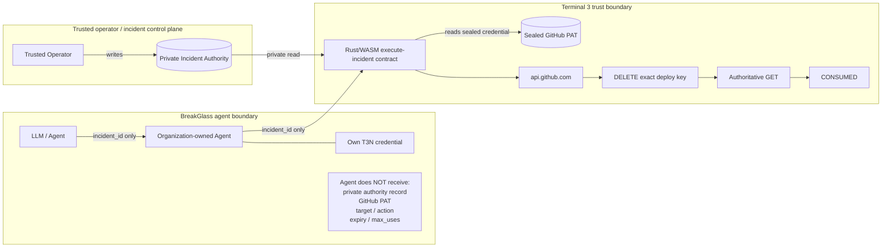

# BreakGlass

Incident-bound emergency authority for AI agents on Terminal 3.

BreakGlass lets an AI agent perform one otherwise-forbidden emergency operation during a specific incident without giving the agent the underlying administrative credential.

An AI agent normally has no GitHub administrative credential and cannot revoke deploy keys. During an active incident, a trusted operator creates a private, short-lived, one-use authority for one exact deploy key. The agent receives only the incident ID.

## Live proof

This is the canonical live Phase 2E run. It used the real Terminal 3 testnet and GitHub; no T3N or GitHub result was faked.

| Check | Observed result |
| --- | --- |
| GitHub key before | exact GET `200`, list GET `200`, target present, read-only |
| Authority before | `ACTIVE`, `0/1` |
| Agent input | `incident_id` only |
| T3N DELETE | contract-reported HTTP `204`, exactly one destructive call |
| T3N verification | authoritative GET `404` |
| Independent GitHub check | exact GET `404`, list `200`, target absent |
| Authority after | `CONSUMED`, `1/1` |
| Replay | `REPLAY_REFUSED` |
| Replay destructive calls | `0` |

Canonical identifiers:

```text
Agent DID: did:t3n:c2cb33e0cb6838dafef6519e5d44a20b56069019
Incident:  INC-PHASE2E-LIVE-1788249253449
Target:    Ticoworld/t3n-breakglass-sandbox#161921323
Action:    revoke_github_deploy_key
```

The DELETE `204` and contract verification `404` are classified as T3N-contract-reported external HTTP results. The before and after GitHub reads are independent GitHub checks. The runtime does not expose a separate external event for every state transition, so this repository does not claim an independently observed `ACTIVE → EXECUTING` event.

The complete sanitized proof is [`evidence/phase2e/phase2e-live-proof.json`](evidence/phase2e/phase2e-live-proof.json), with component evidence and raw command output in [`evidence/phase2e/`](evidence/phase2e/).

## Why T3N is necessary

This is not ordinary application logic around a GitHub token. Terminal 3 provides the trust boundary in which the authority and the credential are separated from the agent:

- a separate agent DID and organization ownership;
- scoped agent egress limited to `api.github.com` for `execute-incident`;
- a private incident authority with a frozen target, action, expiry, and use limit;
- trusted node time for expiry enforcement;
- Rust/WASM execution in the T3N contract;
- a sealed GitHub PAT available to the contract, not to the agent;
- an external HTTP mutation followed by authoritative verification;
- durable one-use state and replay refusal.

The LLM and agent process do not hold or supply the GitHub PAT, repository, deploy-key ID, action, expiry, or max-uses policy. The agent supplies only:

```json
{ "incident_id": "INC-1043" }
```

The operator creates the authority. The T3N contract resolves the private record, authenticates the caller DID, checks time and state, performs the exact operation, verifies the result, and consumes the authority.

## Architecture



The agent knows only its own T3N credential and the `incident_id`. It does not receive the private authority record, GitHub PAT, target, action, expiry, or `max_uses`.

The operator knows the operator T3N credential, GitHub credential, and requested target while creating an authority. The private incident map knows the authority. The agent knows its own T3N credential and the incident ID. The contract knows the private authority, caller DID, trusted time, and sealed credential. GitHub sees only the credential presented inside the T3N HTTP call.

The only destructive capability is `revoke_github_deploy_key`.

## Quickstart

### Prerequisites

- Node.js 22 or compatible current Node;
- Rust with the `wasm32-wasip2` target and `ssh-keygen` for a disposable demo key;
- a Terminal 3 testnet operator credential with enough credit;
- the separately funded, organization-owned replacement agent;
- a private GitHub repository and a fine-grained PAT restricted to that repository with Administration read/write permission.

New organization-owned agents may start with zero usable testnet credits. Terminal 3 funding is required before a metered agent invocation. This repository does not claim automatic funding.

### Environment and SDK

```powershell
npm install
Copy-Item .env.example .env.bootstrap
```

Fill `.env.bootstrap` only with local operator and GitHub values. Configure the separately funded replacement agent in `.env.replacement-agent`. Never start the agent with `.env.bootstrap`; never commit either file. The exact dependency is pinned to:

```text
@terminal3/t3n-sdk@5.2.0
```

The 5.3.0 trust-manifest compatibility finding is preserved in [`docs/BUGS.md`](docs/BUGS.md).

### Existing T3N setup

For a fresh environment, the trusted bootstrap path is:

```powershell
npm run setup-github
npm run bootstrap
npm run authorize-agent
npm run configure-agent-egress
```

Do not rerun provisioning or bootstrap against an existing checkpoint without auditing the target and preserved evidence.

### Safe checks, tests, and build

```powershell
npm run doctor
npm test
npm run build
```

Doctor is read-only. It checks the exact SDK version, trusted manifest, operator authentication, organization-owned replacement agent, card, egress, contract/version, maps, and safely checkable GitHub readiness.

### Create an Incident Authority

The trusted operator supplies the incident ID, exact GitHub target, and TTL. The command resolves the real replacement agent, fixes the action and one-use policy, checks the key, derives expiry from trusted T3N time, prints an exact preview, and requires confirmation:

```powershell
npm run incident:create -- INC-1043 Ticoworld t3n-breakglass-sandbox 123456 300
```

Type `CREATE` when the preview is correct. The operator path writes the authority only after confirmation. The agent cannot call this path.

### Run the agent

For an AI tool client:

```powershell
npm run agent
```

The stdio MCP server exposes only `breakglass_execute_incident({ incident_id })`. For a one-shot terminal adapter:

```powershell
npm run agent:execute -- INC-1043
```

### Run the live demo

```powershell
npm run demo
```

The demo creates one disposable read-only key through the trusted setup path, demonstrates denial, creates an authority, performs the live revocation and verification, independently checks GitHub, and demonstrates replay refusal. It is destructive to the disposable key and must be run only against a disposable target. It does not fake T3N or GitHub and does not overwrite the canonical Phase 2E evidence.

## Security model

The enforced boundaries are:

- the agent cannot create an Incident Authority;
- the agent cannot choose or substitute the target;
- the agent cannot change the action;
- the agent cannot extend expiry or increase max uses;
- the GitHub PAT is absent from the agent process and remains sealed for contract execution;
- contract egress is restricted to `api.github.com`;
- nonexistent, unauthorized, and expired incidents are denied;
- one successful execution consumes the authority;
- replay returns `REPLAY_REFUSED` and issues zero destructive calls;
- ambiguous external outcomes enter `RECONCILE_REQUIRED` and reconcile with GET-only behavior.

The detailed boundaries and out-of-scope cases are in [`docs/THREAT_MODEL.md`](docs/THREAT_MODEL.md) and [`docs/ARCHITECTURE.md`](docs/ARCHITECTURE.md). The reproducibility and recovery procedure is in [`docs/HANDOVER.md`](docs/HANDOVER.md).

## Evidence and bug reports

[`docs/EVIDENCE.md`](docs/EVIDENCE.md) indexes claims to the exact sanitized evidence and identifies whether each claim is directly observed, contract-reported, or independently verified.

[`docs/BUGS.md`](docs/BUGS.md) preserves the SDK 5.3.0 compatibility issue, the createAgent/default-card API ambiguity, the observed zero-credit limitation, and the observed diagnostic limitation without overstating them.

## License

BreakGlass is available under the [MIT License](LICENSE).

## Post-challenge

I’m happy to continue developing BreakGlass after the challenge. The current implementation is deliberately limited to one proven emergency action, and the repository includes a handover guide for Terminal 3 or another maintainer if ownership needs to transfer.

A future emergency action should be added as a separate bounded contract action with an explicit target schema, least-privileged egress, sealed secret, independent verification, one-use state transition, reconciliation behavior, adversarial tests, and live disposable evidence. The agent input should remain incident-bound.
